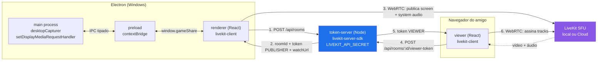
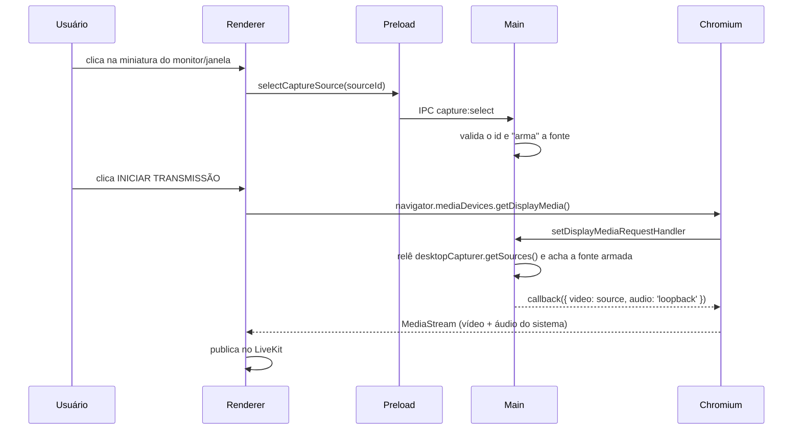

# Arquitetura — Game Share POC V0.1

## Visão geral

Três processos independentes. O único que conhece o segredo do LiveKit é o
**token-server**; desktop e viewer só recebem tokens já assinados.



## Separação publisher / viewer

As permissões nunca vêm do cliente. Elas são montadas apenas em
[`services/token-server/src/tokens.ts`](../services/token-server/src/tokens.ts):

| Grant              | PUBLISHER | VIEWER |
| ------------------ | :-------: | :----: |
| `roomJoin`         |     ✅    |   ✅   |
| `canSubscribe`     |     ✅    |   ✅   |
| `canPublish`       |     ✅    |   ❌   |
| `canPublishData`   |     ✅    |   ❌   |
| `room` (escopo)    | 1 sala    | 1 sala |

Consequências:

- Um espectador que edite o JS da página **não** consegue publicar: o token
  assinado no servidor não carrega `canPublish`, e o SFU rejeita.
- Um token vale para **uma sala só** (`room: roomId` no grant). Vazar o link de
  uma transmissão não dá acesso a outra.
- O `roomId` é gerado **no servidor** (`POST /api/rooms` ignora qualquer corpo).
  O cliente nunca escolhe o nome da sala.
- `POST /api/rooms/:roomId/end` encerra a sala no SFU e usa **o próprio token de
  publisher como credencial** (`Authorization: Bearer`). Quem só tem o link
  recebeu um token de viewer, sem `canPublish`, então não consegue derrubar a
  transmissão de outra pessoa — e não foi preciso guardar estado nenhum para
  isso. O `roomId` é validado antes de olhar o token.

## Endpoints

| Método | Rota | Quem chama | Autorização |
| ------ | ---- | ---------- | ----------- |
| `GET` | `/health` | qualquer um | — |
| `POST` | `/api/rooms` | desktop | — (o servidor gera o `roomId`) |
| `POST` | `/api/rooms/:roomId/viewer-token` | viewer | — (conhecer o link basta) |
| `POST` | `/api/rooms/:roomId/end` | desktop | token de publisher da sala |

## Identidades

`pub-<hex>` para o streamer, `view-<hex>` para espectadores
([`packages/shared/src/identity.ts`](../packages/shared/src/identity.ts)).
Isso deixa os dois lados contarem espectadores e detectarem "o streamer saiu"
usando só `room.remoteParticipants`, sem metadados inventados.

## Fluxo de captura no Windows



Pontos importantes:

- `useSystemPicker: false` — a escolha acontece na nossa UI, com thumbnail.
- Se nenhuma fonte estiver armada, o handler responde `callback({})` e o
  `getDisplayMedia` rejeita. Não existe caminho para capturar sem escolha
  explícita do usuário.
- A fonte é relida no momento do handler: se a janela foi fechada nesse
  intervalo, o erro é explícito em vez de capturar a janela errada.
- `audio: 'loopback'` captura o áudio **do sistema** (Windows). Não capturamos
  microfone nesta fase — a call continua no Discord.

## Segurança do Electron

| Item | Valor |
| ---- | ----- |
| `contextIsolation` | `true` |
| `nodeIntegration` | `false` |
| `sandbox` | `true` (main e preload compilados em CJS por isso) |
| `webSecurity` | `true` |
| Superfície do preload | 7 funções, sem nenhuma API de Node |
| Permissões | só `display-capture`; todo o resto é negado |
| `window.open` / navegação externa | bloqueados |
| CSP | injetada por `onHeadersReceived` no main |

CSP em produção:

```
default-src 'self'; script-src 'self'; style-src 'self' 'unsafe-inline';
img-src 'self' data: blob:; media-src 'self' blob:; worker-src 'self' blob:;
connect-src 'self' https: wss:; object-src 'none'; frame-src 'none';
base-uri 'none'; form-action 'none'
```

Em dev, `script-src` ganha `'unsafe-inline' 'unsafe-eval'` e `connect-src`
ganha `localhost`/`127.0.0.1` por causa do HMR do Vite.

> **TODO (v0.2):** estreitar `connect-src` para as origens exatas do
> token-server e do LiveKit. Hoje a URL do LiveKit só é conhecida em runtime
> (vem na resposta do token-server), e duplicá-la numa var `VITE_*` só para
> montar a CSP criaria duas fontes de verdade que saem de sincronia.

## Qualidade

Padrão **720p30**, `simulcast: false`, `degradationPreference:
'maintain-framerate'` (para jogo, fps importa mais que nitidez). O seletor de
qualidade na tela de escolha de fonte expõe também 1080p30 / 1080p60 / 1440p60,
definidos em [`packages/shared/src/types.ts`](../packages/shared/src/types.ts);
o padrão vem de `DEFAULT_PRESET`. Só o 720p30 foi testado.

O preset é aplicado no momento da captura, então trocá-lo exige reiniciar a
transmissão — o `<select>` fica desabilitado depois que ela começa.

### Duas armadilhas que custaram caro

Ambas silenciosas: nenhuma gera erro, e o `qualityLimitationReason` do WebRTC
reportava `"none"` durante as duas.

**1. `getDisplayMedia` ignora constraints `ideal`.** Uma webcam negocia com
`ideal`; o capturador de tela do Chromium trata como sugestão. Pedindo
`{ width: { ideal: 1280 } }` numa tela 1080p, a captura vinha 1920×1080@60. Por
isso as constraints usam `max`, com `applyConstraints` reaplicando e um log
`captura configurada` comparando pedido × realidade.

Consequência de projeto: `max` nunca faz upscale, então **a resolução do preset
é um teto**. Em telas menores que o preset, o que muda de fato é bitrate e fps.

**2. Para `Track.Source.ScreenShare`, o livekit-client lê
`screenShareEncoding` e ignora `videoEncoding`.** O padrão é
`ScreenSharePresets.h1080fps15` — teto de **15 fps**. Um `videoEncoding` com
`maxFramerate: 30` é aceito sem reclamar e não tem efeito nenhum.

O sintoma que denunciou: o fps codificado era *constante* (~15) mesmo quando a
entrada caiu de 60 para 30 fps. Limite de CPU escala com a carga; teto fixo não.
Há um e2e que trava isso lendo
`sender.getParameters().encodings[0].maxFramerate`.

**Simulcast fica desligado de propósito.** Ele faria o streamer codificar várias
camadas simultâneas, gastando CPU que deveria estar no jogo. Para um SFU e
poucos amigos, camada única é a escolha certa até alguém medir o custo real.

## Métricas

Só API pública do SDK:

| Métrica | Origem |
| ------- | ------ |
| Resolução | `mediaStreamTrack.getSettings()` |
| FPS de captura | `mediaStreamTrack.getSettings().frameRate` |
| FPS codificado | `LocalTrack.getRTCStatsReport()` → `outbound-rtp.framesPerSecond` |
| Bitrate | delta de `outbound-rtp.bytesSent` entre duas amostras (1,5 s) |
| Qualidade | `RoomEvent.ConnectionQualityChanged` |
| Estado | `RoomEvent.ConnectionStateChanged` |
| Espectadores | `room.remoteParticipants` filtrado por prefixo de identidade |

RTT e banda estimada vêm do par de candidatos ICE em uso
(`candidate-pair` com `nominated` e `state: "succeeded"`) —
`currentRoundTripTime` e `availableOutgoingBitrate`. Essa fonte é confiável
enquanto a conexão existe, ao contrário de `remote-inbound-rtp.roundTripTime`,
que só aparece depois dos primeiros relatórios RTCP e some sem assinante.

`availableOutgoingBitrate` existe por um motivo concreto: numa sessão real o
fps codificado caiu para 1 durante ~2,5 minutos **com a captura intacta em 60
fps**, e sem essa métrica não havia como distinguir colapso do estimador de
banda de falha do encoder. O SFU não registrou perda nem queda de qualidade na
mesma janela.

Nenhuma propriedade privada do LiveKit é acessada.

## Trocar localhost por domínio

Nada no código conhece `localhost`. Só o `.env`:

- `VITE_VIEWER_BASE_URL` — base usada para montar o link `/watch/:roomId`
  (`buildWatchUrl`, no token-server).
- `LIVEKIT_URL` — o token-server devolve essa URL para os clientes, então
  desktop e viewer sempre apontam para o mesmo SFU sem configuração própria.
- `ALLOWED_ORIGINS` — CORS do token-server.

Para produção: `VITE_VIEWER_BASE_URL=https://seu-dominio`,
`LIVEKIT_URL=wss://…`, e servir a build do viewer com fallback de SPA.
